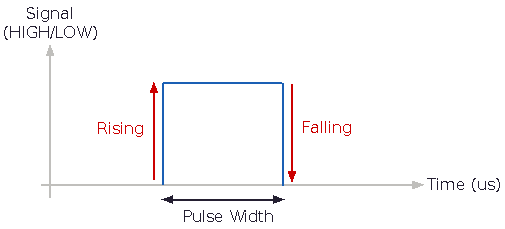

# PulseInput
This is a simple library for an interrupt based, non-blocking alternative to Arduino's [pulseIn](https://reference.arduino.cc/reference/cs/language/functions/advanced-io/pulsein/) function. 

This library is well suited to read the channels of a RC receiver or the output of an ultrasonic distance sensor. Given that it uses interrupts to measure the signals, one can read multiple signals without delays in the main loop.  

# How it works
A pin change interrupts is used to detect when a signal is rising or falling, and the _on-time_ of the signal is measured in microseconds. As such, this library is only suited to decode PWM-like signals, where the time of the pulse-width (on-time) determines the value of the signal.

# Dependencies
This library depends on the [PinChangeInterrupt](https://github.com/NicoHood/PinChangeInterrupt) library, so it works with standard Arduinos (Uno, Nano, Mega, etc) and the digiSpark ATTinys boards. Please see the documentation of PinChangeInterrupt to see if your board is supported.

